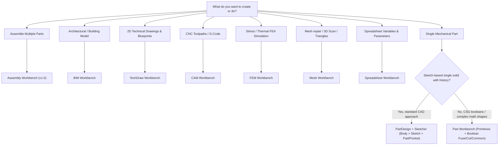

# FreeCAD User Skill

This skill guides AI agents in assisting users with day-to-day FreeCAD tasks: modeling parts, navigating workbenches, setting up assemblies, creating 2D technical drawings, and avoiding common pitfalls like the Topological Naming Problem (TNP).

Based on the official [FreeCAD Documentation: Users hub](https://github.com/FreeCAD/FreeCAD-documentation/blob/main/wiki/User_hub.md).

---

## Workbench Selection Decision Tree

Choosing the correct workbench is the first and most critical decision in FreeCAD:



### Key Differences: PartDesign vs Part

| Aspect | PartDesign Workbench | Part Workbench |
| :--- | :--- | :--- |
| **Philosophy** | Feature-based parametric modeling. Builds a **single continuous solid** inside a `PartDesign::Body`. | Constructive Solid Geometry (CSG). Combines independent geometric primitives. |
| **Workflow** | `Body` &rarr; `Sketch` (on plane/face) &rarr; `Pad` / `Revolution` &rarr; `Pocket` / `Hole` &rarr; `Fillet` / `Chamfer`. | Make Primitives (`Box`, `Cylinder`) &rarr; Transform Placement &rarr; Apply Boolean (`Cut`, `Fuse`, `Common`). |
| **Output** | Strict single solid per Body. Only one tip active at a time. | Multiple independent solids, compounds, and disjoint shapes. |
| **When to Use** | Recommended for 90% of mechanical 3D parts and 3D printing. | Best for simple CSG assemblies, boolean repairs, or non-manifold models. |

---

## Fundamental Workflows

### 1. Parametric Part Design (Standard Recipe)
1. **Create Body**: Always start by creating a `PartDesign Body`.
2. **Create Sketch**: Attach the sketch to a standard base plane (`XY_Plane`, `XZ_Plane`, or `YZ_Plane`).
3. **Constrain Fully**: Use geometric constraints (coincident, horizontal, vertical, tangent) and dimensional constraints (distance, radius, angle). Ensure the sketch turns green (**Fully Constrained** with 0 degrees of freedom).
4. **Create Additive Feature**: Use `Pad` (extrude), `Revolution` (revolve), `AdditiveLoft`, or `AdditivePipe`.
5. **Create Subtractive Feature**: Create another sketch (preferably on a datum plane) and use `Pocket`, `Hole`, or `Groove`.
6. **Apply Dress-Up Last**: Apply `Fillet` and `Chamfer` at the very end of the tree.

### 2. Avoiding the Topological Naming Problem (TNP)
FreeCAD references faces/edges internally as `Face1`, `Edge4`, etc. Modifying an early sketch can renumber subsequent faces, breaking downstream sketches mapped directly to them.

**Golden Rules to Prevent Model Breakage**:
- **Attach sketches to Datum Planes or Base Planes**, NOT directly to model faces.
- Use **Datum Planes / Datum Lines** with offsets or attached to reference geometry.
- If referencing external geometry from another body or feature, use **ShapeBinder** or **SubShapeBinder**.
- Put fillets, chamfers, and cosmetic drafts at the very end of the tree.
- Note: FreeCAD 1.0 integrates the Topological Naming mitigation algorithm, but Datum-first design remains the cleanest CAD practice.

### 3. Creating Parametric Models with Spreadsheets
1. Switch to **Spreadsheet Workbench** and create a new Spreadsheet.
2. In column A, write parameter names (e.g., `Length`, `Width`, `WallThickness`).
3. In column B, write values (e.g., `50 mm`, `30 mm`, `3 mm`).
4. Right-click column B cells &rarr; **Properties** &rarr; **Alias** &rarr; give alias (e.g., `length`, `thickness`).
5. In your Sketches or Pad depths, click the small fx icon and enter formula: `Spreadsheet.length` or `Spreadsheet.thickness`.

---

## Detailed References

For comprehensive deep dives, consult the following manuals in `references/`:
- [Commands Reference Catalog](./references/commands_reference.md): Exhaustive table of all 183 standard `Std_*` commands and workbench commands (`PartDesign_*`, `Sketcher_*`, `Part_*`, `TechDraw_*`, etc.) with shortcuts.
- [Menus & Interface Reference](./references/menus_and_interface.md): Complete breakdown of standard top menus (File, Edit, View, Tools, Macro, Windows, Help), workbench menus, and dockable UI panels.
- [Workbenches Overview](./references/workbenches_overview.md): Comprehensive catalog of all 20 built-in workbenches and popular external add-on workbenches.
- [Tutorials, Manual & CAD Glossary](./references/tutorials_and_glossary.md): Index of all 79 official FreeCAD tutorials, learning paths, and CAD terminology.
- [FAQ & Troubleshooting Guide](./references/faq_and_troubleshooting.md): Top user questions, performance tips, and canonical CAD workarounds.
- [Modeling Best Practices & TNP](./references/modeling_best_practices.md): Step-by-step guidance on stable parametric modeling.
- [File Formats & Interoperability](./references/file_formats_interop.md): Exporting and importing STEP, IGES, STL, OBJ, DXF, SVG, and FCStd.
- [Migration Guide](./references/migration_guide.md): Cheatsheet for users moving from SolidWorks, Fusion 360, OnShape, or Revit.
- [Step-by-Step Modeling Example](./examples/parametric_part_workflow.md): Complete walkthrough of designing a parametric enclosure.

### Offline Documentation Search Tool
When an agent or user needs specific details on any of FreeCAD's 2,595+ documentation pages, run:
```bash
python scripts/freecad_doc_query.py "<command_or_topic>"
```
